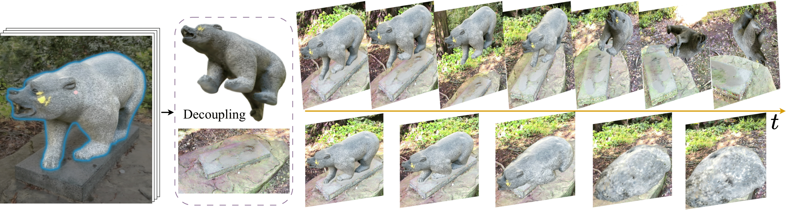

# [CVPR2025] DecoupledGaussian: Object-Scene Decoupling for Physics-Based Interaction

### [[Project Page](https://wangmiaowei.github.io/DecoupledGaussian.github.io/)] [[arXiv](https://arxiv.org/abs/2503.05484v1)] 

Miaowei Wang<sup>1</sup>\, Yibo Zhang<sup>2</sup>\, Rui Ma<sup>2</sup>\, Weiwei Xu<sup>3</sup>\, Changqing Zou<sup>3</sup>, Daniel Morris<sup>4</sup><br>
<sup>1</sup>The University of Edinburgh, <sup>2</sup>
Jilin University, <sup>3</sup>Zhejiang University, <sup>4</sup>Michigan State University <br>


---

### Abstract

*We present DecoupledGaussian, a novel system that decouples static objects from their contacted surfaces captured in-the-wild videos, a key prerequisite for realistic Newtonian-based physical simulations. Unlike prior methods focused on synthetic data or elastic jittering along the contact surface, which prevent objects from fully detaching or moving independently, DecoupledGaussian allows for significant positional changes without being constrained by the initial contacted surface. Recognizing the limitations of current 2D inpainting tools for restoring 3D locations,
our approach uses joint Poisson fields to repair and expand the Gaussians of both objects and contacted scenes after separation. This is complemented by a multi-carve strategy to refine the object’s geometry. Our system enables realistic simulations of decoupling motions, collisions, and fractures driven by user-specified impulses, supporting complex interactions within and across multiple scenes. We validate DecoupledGaussian through a comprehensive user study and quantitative benchmarks. This system enhances digital interaction with objects and scenes in real-world environments, benefiting industries such as VR, robotics, and autonomous driving.*

---
## 📑 Open-Source Plan

- [x] Teaser Simulation Cases
- [x] Upload Other Simulation Cases
- [ ] Gaussian Preparation Code (**🚨 RELEASE BEFORE JUNE 20, 2025! 🚨**)
- [ ] Gaussian Restoration Code (**🚨 RELEASE BEFORE JUNE 20, 2025! 🚨**)
## Restored Gaussian and Simulation Cases 

Please read our config.json in the simulation cases forder
| Cases    | Restored Gaussian Links    | Simulation Cases    |
|--------|--------|--------|
| Room  | [Object](https://drive.google.com/file/d/1vG2Q75Pd9ZEv1qvYMyDpqe-r7DDB4DdA/view?usp=sharing) [Scene](https://drive.google.com/file/d/1jszQPIELNgPIg7jGhdXnuxfih3WFJYEF/view?usp=sharing)    | [Motion](https://drive.google.com/drive/folders/1HriHz_IFjxoE2UarHvesXXxpMrHwAKyG?usp=sharing)  |
| Kitchen  | [Object](https://drive.google.com/file/d/1M7O2zNwP-NXTf3XewKDXTF3zPxoqnRlP/view?usp=sharing) [Scene](https://drive.google.com/file/d/1fi0eD50IGaFqkzVKcJjQeE2eirXHUZIF/view?usp=sharing) | [Falling](https://drive.google.com/drive/folders/1jai_hNEOqj9CjMC4zqmCHf4AGPQR7SjV?usp=sharing) [Sand](https://drive.google.com/drive/folders/1ILgXJiIokvbkMkBa9qHkafRWw6ZKuCr7?usp=sharing) |
| Truck_Bicycle  | [Truck Object](https://drive.google.com/file/d/1GH8WBVzDN53va4T5LcrR0rd8_tqNJlhL/view?usp=sharing) [Bicycle Scene](https://drive.google.com/file/d/19aND0SE_bvXdAO1y3zIyePWICjoRbHPr/view?usp=sharing) | [Falling](https://drive.google.com/drive/folders/1zahMTEO4A0VjGVa1nRfitgXMMyjYmkKW?usp=sharing) |
| Bonsai  | [Object](https://drive.google.com/file/d/1cm_GIFIGIevIAuGRdwm07w-7w0hM07B1/view?usp=sharing) [Scene](https://drive.google.com/file/d/19jDL5X9Xzbd_a7AAAsh-9FYzh4-6388N/view?usp=sharing) | [Falling](https://drive.google.com/drive/folders/1t7LuBXt_f7JphWyJ2-OlHrfzUcReowlV?usp=sharing) [Tearing](https://drive.google.com/drive/folders/1I0d8h-F-m0Ck-kYe_RPN3ZgpTrPf1Dk6?usp=sharing)|
| Figurines  | [All Object](https://drive.google.com/drive/folders/1Pi7e66-Mjeua5Btfzm26kpu3_uSpShNd?usp=sharing) |[Collision](https://drive.google.com/drive/folders/1d8aZvsnfyNznp37YIv6mynj1w1JISh48?usp=sharing)|
| Garden  | [Object](https://drive.google.com/file/d/1HBgAS9JVPnqKYERWk3q3v7PohuU309uS/view?usp=sharing) [Scene](https://drive.google.com/file/d/1zUBWBUVs2QlEzmoRs_hEqyCgC76U-aJg/view?usp=sharing)|[Collision](https://drive.google.com/drive/folders/17GJP_3GpHGHZK8Zg1u-paB8aYfQH3KMG?usp=drive_link)|
## Environment Setup
```bash
# Clone Repository 
git clone --recursive https://github.com/wangmiaowei/DecoupledGaussian.git

# Navigate to the project directory
cd DecoupledGaussian

# Install required Python packages
pip install -r requirements.txt
pip install -e gaussian-splatting/submodules/diff-gaussian-rasterization/
pip install -e gaussian-splatting/submodules/simple-knn/
```

---

## Interactive Simulation

Our algorithm has been tested on multiple datasets. Below is an example simulation for the *bear* object as illustrated in **Figure 1**.

```bash
# Navigate to the dataset folder
cd dataset/bear_data

# Download GS models using the anonymous links
gdown https://drive.google.com/file/d/1HoOgTgajUsrLujIk6PJmZ084J_GKmEj_/view?usp=drive_link
gdown https://drive.google.com/file/d/1m9DUDEINvOza9qxgPqvyjvEBcSrbkDVx/view?usp=drive_link

# Return to the main directory
cd ../..

# Run the Teaser Simulation
python gs_simulation.py \
--object_path dataset/bear_data/bear_obj_0.ply \
--scene_path dataset/bear_data/bear_scene_0.ply \
--output_path result_bear \
--config config/bear_config.json \
--render_img --compile_video

# Access the rendered video "output.mp4"
cd result_bear 

```


---
## Citation

   If you find our repo useful for your research, please consider citing our paper:

   ```bibtex
    @InProceedings{decoupledGaussian,
    title={DecoupledGaussian: Object-Scene Decoupling for Physics-Based Interaction},
    author={Wang, Miaowei and Zhang, Yibo and Ma, Rui and Xu, Weiwei and Zou, Changqing and Morris, Daniel},
    booktitle={Proceedings of the IEEE/CVF Conference on Computer Vision and Pattern Recognition},
    year={2025}}
   ```


## Acknowledgement

This simulation code is built upon [PhysGaussian](https://github.com/XPandora/PhysGaussian). Thanks to the contributors for their great work.


