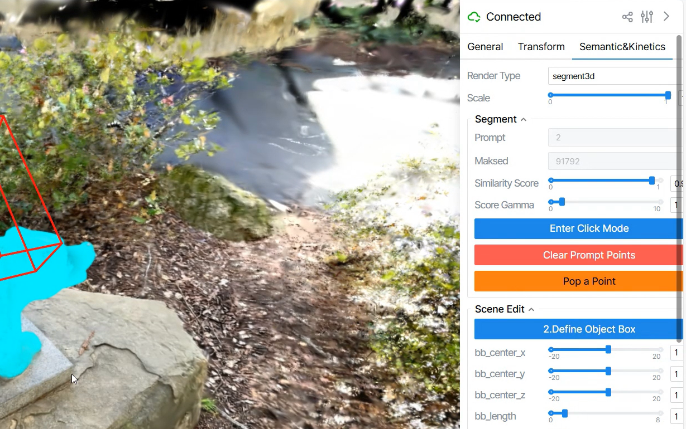
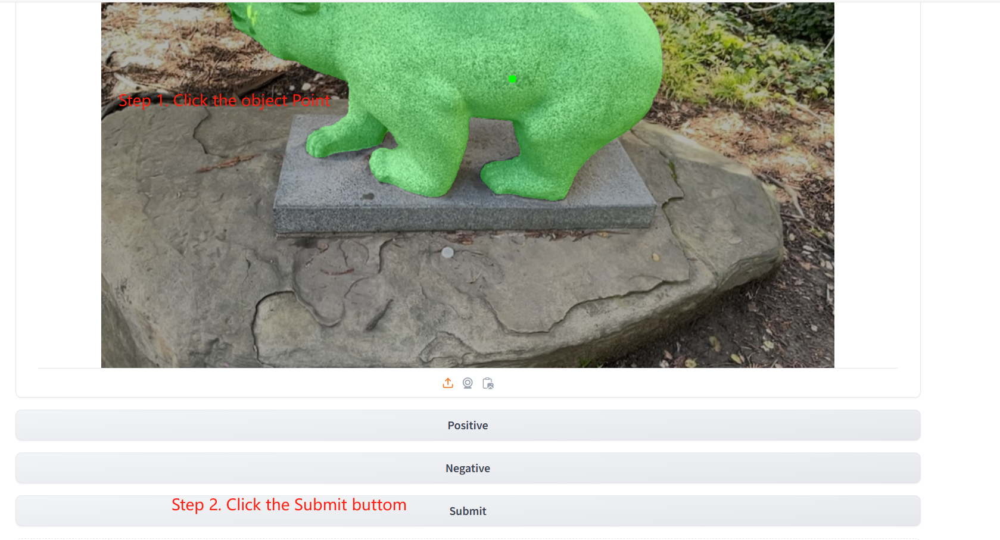

# ⚙️ 1. Environment Preparation

Please refer to the [`requirements.txt`](./requirements.txt) file for all Python packages required in this project.

In addition to the Python environment, our pipeline also depends on the following external libraries and pretrained weights:

- **PoissonRecon**: Used for joint Poisson reconstruction fields
- **LAMA**: Used for final texture refinement
- **SAM2**: Used for generating masks from videos
- **Pretrained weights**: Stored under the `weights/` directory

Follow the steps below to install these dependencies and prepare the required resources:

```bash
# Step 1: Install Poisson Surface Reconstruction
cd weights
sudo apt update
sudo apt install libpng-dev libjpeg-dev
git clone --recursive https://github.com/mkazhdan/PoissonRecon.git
cd PoissonRecon
make -j16
cd ..

# Step 2: Install SAM2
cd sam2
# ⚠️ You may need to edit 'setup.py' to resolve conflicts with your Python environment
pip install -e .
cd ..

# Step 3: Install LAMA (for inpainting)
cd simple_lama_inpainting
pip install simple-lama-inpainting
cd ../..

# Step 4: Download pretrained weights

# LAMA inpainting model
wget -O ./weights/big-lama.pt https://github.com/enesmsahin/simple-lama-inpainting/releases/download/v0.1.0/big-lama.pt

# SAM-v1 segmentation model
wget -O ./weights/sam_vit_h_4b8939.pth "https://huggingface.co/HCMUE-Research/SAM-vit-h/resolve/main/sam_vit_h_4b8939.pth?download=true"

# SAM2 segmentation model
wget -O ./weights/sam2_hiera_large.pt https://dl.fbaipublicfiles.com/segment_anything_2/072824/sam2_hiera_large.pt
```
After setup, your  [`weights/`](./weights) folder should contain the following structure:
```
weights/
    ├── PoissonRecon/
    ├── sam2/
    ├── simple-lama-inpainting/
    ├── big-lama.pt
    ├── sam_vit_h_4b8939.pth
    └── sam2_hiera_large.pt
```

We also rely on [PGSR](https://github.com/zju3dv/PGSR) as part of the Gaussian preparation pipeline. Please install its necessary submodules with the following commands:
```bash
cd PGSR
pip install submodules/diff-plane-rasterization
pip install submodules/simple-knn
cd ..
```

Then, we demonstrate how to prepare a dataset using the BEAR example. Of course, you are free to use your own image sequences by following the same directory and file name structure:
```
Your_Customized_obj_name/
    ├── images/
              ├──  frame_00001.jpg
              ├──  frame_00002.jpg
              ├──      ...
```
⚠️ While we haven't fully tested other naming formats, following this format is recommended to avoid unnecessary bugs. Let’s walk through the BEAR dataset setup:
```shell
#  Download the dataset (requires gdown: pip install gdown)
gdown 1eMqwbXn7M6r-x5guZNo6rornTQL6g7d0

# move zip, unzip zip
mv  bear.zip  input_dataset/
cd input_dataset
unzip bear.zip
rm -rf bear.zip
cd ..

# Preprocess using COLMAP
python PGSR/scripts/preprocess/convert.py --data_path ./input_dataset/bear

# Start PGSR training
python PGSR/train.py -s ./input_dataset/bear -m ./exp_res/bear --max_abs_split_points 0 --opacity_cull_threshold 0.05

## Orient normals of mesh
python PGSR/render_orientnormals.py  -m ./exp_res/bear --max_depth 10.0 --voxel_size 0.01

```


# 🧩 2. Segment Gaussian
Segmenting the object Gaussians from the contact surface can be a bit tedious and engineering-heavy. To simplify this process, we have preprocessed the Bear example for you. You can directly download the prepared results using:
```shell
# Download the Bear Gaussian results zip using gdown (requires: pip install gdown)
gdown 121Lcqi533W-vlSu2W9qFfvNQxsBA7-KP

# Move the zip file to the appropriate results folder
mv bear.zip GaussianSplattingLightning/results_here/

# Unzip and clean up
cd GaussianSplattingLightning/results_here
unzip bear.zip
rm bear.zip
cd ../..
```
If you prefer to segment from scratch or apply it to your own data, please follow the guidance below:
```shell
# Here our program is based on Gaussian splatting Lightning
# https://github.com/yzslab/gaussian-splatting-lightning
cd GaussianSplattingLightning
data_path=../input_dataset/bear
res_path=../exp_res/bear

# Get all mask for each image
python utils/get_sam_masks.py $data_path/images

# Get their scales
python utils/get_sam_mask_scales.py --model_path=$res_path --data_path=$data_path
# Segment Gaussian based on https://github.com/Jumpat/SegAnyGAussians
python seganygs.py fit \
    --config configs/segany_splatting.yaml \
    --data.path  $data_path  \
    --model.initialize_from $res_path \
    -n $res_path -v seganygs \
    --viewer

# Open Our interactive viewer:
python viewer.py $res_path/seganygs
cd ..
```
The screenshot of our interactive viewer is shown below:



We provide an intuitive interface to perform object-scene decoupling. The coarse decoupling steps are as follows:

1. **Enter Click Mode**: Select the object by clicking on a point belonging to it. Then click **Exit Click Mode** once done.
2. **Define Object Box**: Use the interactive handles to adjust the red bounding box around the selected object.
3. **Set as Scene Box**: Convert the red object box to a green scene box using this option.
4. **Extract Object Mesh**: Generate the proxy points representing the object.
5. **Remove the Selected Object's Gaussians**: Remove the object's Gaussians from the scene to isolate it.
6. **Split Bounding Scene and Others**: Separate the scene boundary from the remaining content.

For a detailed demonstration, please refer to our instruction video on YouTube:
👉 [https://youtu.be/Y4CDc1r4sJ4](https://youtu.be/Y4CDc1r4sJ4)


# 3. Restore Gaussian Splatting

3.1. Please use our joint point fileds to get the geometry recovered
```shell
cd JointPointFields
# reconstruct two poisson fields
python step1_poisson_recons.py bear # two indepednet poisson fields 
python step2_get_coarse_obj.py bear # recover the object 
python step3_repair_scene_gaussian.py bear # recover the scene
cd ..
```
3.2. Besides, in order to get the mask lables, we have to select label by:
```shell
cd mask_inpaint
python mask_app.py bear
```
Open the single object segmentation viewer like the above viewer in your browser with screenshot as



We have two steps, click the object and then Submit here.

3.3. Then we try to impaint this masked region by
```shell
python LAMA_impaint.py bear
cd ..
```

3.4 The final step is to finetune Gaussians for both the object and contact surface with steps:

```shell
cd ../PGSR
python train_obj.py bear # Fintune the object
python train_surface.py  bear # Fintune the contact surface
```

3.5 Finally you can visualize restored object, contact surface, or both by:
```shell
cd ../GaussianSplattingLightning

# view the restored object 
python viewer.py ../exp_res/bear/point_cloud_obj/iteration_37000/point_cloud.ply
# view the restored scene 
python viewer.py ../exp_res/bear/point_cloud_scene/iteration_35000/point_cloud.ply
```

# Installl Poisson Reconstruction


# Using PGSR to Process 
python PGSR/scripts/preprocess/convert.py --data_path ./input_dataset/bear
python PGSR/train.py -s ./input_dataset/bear -m ./exp_res/bear --max_abs_split_points 0 --opacity_cull_threshold 0.05
## Orient normals of mesh
python PGSR/render_orientnormals.py  -m ./exp_res/bear --max_depth 10.0 --voxel_size 0.01

# Please modify  "data_path","res_path" in ./GaussianSplattingning/run.sh

cd GaussianSplattingLightning
data_path=../input_dataset/bear
res_path=../exp_res/bear

python utils/get_sam_masks.py $data_path/images
# # Rendering and Extract Mesh

python utils/get_sam_mask_scales.py --model_path=$res_path  --data_path=$data_path
python seganygs.py fit \
    --config configs/segany_splatting.yaml \
    --data.path  $data_path  \
    --model.initialize_from $res_path \
    -n $res_path -v seganygs \
    --viewer
python viewer.py $res_path/seganygs

# crop object, scene and left stuff using our interactive webpage
cd ..
cd JointPointFields
# reconstruct two poisson fields
python step1_poisson_recons.py bear
python step2_get_coarse_obj.py bear
python step3_repair_scene_gaussian.py bear
cd ..

# Launch a manually select object mask server
python mask_app.py bear
cd ../PGSR
python train_obj.py bear # Fintune the object mesh

# Impaitnting object with mask
python LAMA_impaint.py bear
cd ../PGSR
python train_surface.py  bear
cd ../GaussianSplattingLightning
 python viewer.py ../exp_res/bear/point_cloud_scene/iteration_35000/point_cloud.ply
 
```